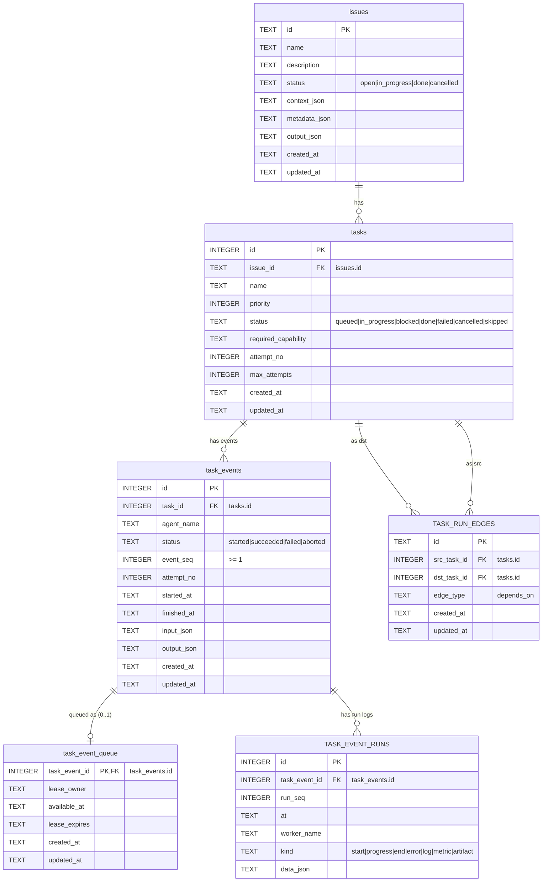
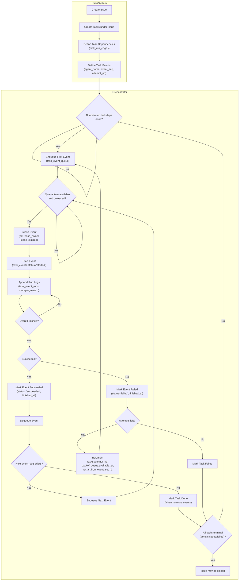

# Agent Foundry

## A lightweight SQLite orchestration core for agentic workflows

Agent Foundry provides a minimal schema and trigger set to coordinate LLM agents performing structured tasks.
It tracks **issues → tasks → agent events → runs** using a directed acyclic graph (DAG).

## Schema Overview

| Table                | Purpose                                   |
|----------------------|-------------------------------------------|
| **issues**           | Top-level work items (tickets). |
| **tasks**            | Units of work under each issue; include status, retries, and required capability. |
| **task_run_edges**   | DAG edges defining task dependencies (`src_task_id → dst_task_id`). |
| **task_events**      | Ordered steps (agents) for each task, e.g., dev → QA → review. |
| **task_event_queue** | Queue for ready-to-run events; supports leasing and backoff. |
| **task_event_runs**  | Immutable log of actions inside an event (start, progress, end, error). |

## Key Features

- **Dependency-safe DAG**: recursive triggers prevent cycles.
- **Task sequencing**: `event_seq` orders agent actions within a task.
- **Queue leasing**: `lease_owner`, `available_at`, and `lease_expires` coordinate work pickup.
- **Immutable logs**: updates/deletes blocked on `task_event_runs`.
- **Status guards**: prevents closing issues or tasks while active dependents remain.
- **Retry control**: prevents `attempt_no` from exceeding `max_attempts`.

## ERD



## Basic Flow



### Create an issue

 ```sql
 INSERT INTO issues (id, name, context_json) VALUES ('ISS-1', 'Demo Issue', '{}');
 ```

### Create tasks

 ```sql
 INSERT INTO tasks (issue_id, name, required_capability) VALUES ('ISS-1', 'Dev Work', 'dev');
 INSERT INTO tasks (issue_id, name, required_capability) VALUES ('ISS-1', 'QA Review', 'qa');
 ```

### Define dependencies

 ```sql
 INSERT INTO task_run_edges (id, src_task_id, dst_task_id)
 VALUES ('edge1', 1, 2); -- task 2 waits for task 1
 ```

### Create task events

 ```sql
 INSERT INTO task_events (task_id, agent_name, event_seq, attempt_no)
 VALUES (1, 'dev-agent', 1, 0),
(2, 'qa-agent', 1, 0);
 ```

### Queue the first event

 ```sql
 INSERT INTO task_event_queue (task_event_id) VALUES (1);
 ```

### Lease and process

 ```sql
 UPDATE task_event_queue
 SET lease_owner='dev-agent',
 lease_expires=strftime('%Y-%m-%dT%H:%M:%fZ','now','+10 minutes')
 WHERE task_event_id=1
 AND lease_owner IS NULL
 AND available_at <= strftime('%Y-%m-%dT%H:%M:%fZ','now');
 ```

### Log runs

 ```sql
 INSERT INTO task_event_runs (task_event_id, run_seq, worker_name, kind, data_json)
 VALUES (1, 1, 'worker-a', 'start', '{}'),
(1, 2, 'worker-a', 'end', '{"result":"ok"}');
 ```

### Complete event

 ```sql
 UPDATE task_events
 SET status='succeeded', finished_at=strftime('%Y-%m-%dT%H:%M:%fZ','now')
 WHERE id=1;
 DELETE FROM task_event_queue WHERE task_event_id=1;
 ```

## Concept Summary

- **Issues** are containers for **tasks**.
- **Tasks** depend on one another (DAG edges).
- Each **task** is executed through ordered **agent events**.
- **Events** enter the **queue** when ready and are leased to agents.
- Agents append **run logs** to `task_event_runs` as immutable facts.
- When all tasks in an issue succeed, the issue can be closed.

## Integration Notes

- Use with any language via SQLite (Node, Python, Go, etc.).
- Works offline and embeds cleanly in agentic frameworks.
- Combine with a lightweight orchestrator script to enqueue, lease, and monitor progress.
- Define each flow as a tool for your agents to use.
